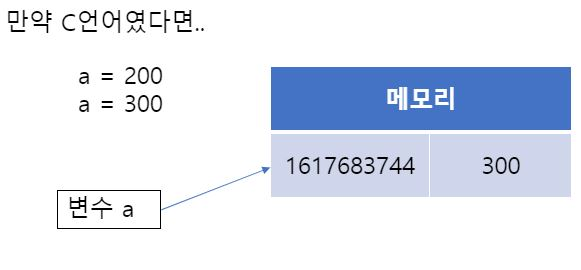

# Python - Call By Assignment

<br/>

### 목차

- <a href="https://github.com/SangYoonLee1231/TIL/blob/main/Python/python_call_by_assignment.md#mutable-vs-immutable"><code>mutable</code> VS <code>immutable</code></a>
- <a href="https://github.com/SangYoonLee1231/TIL/blob/main/Python/python_call_by_assignment.md#python%EC%97%90%EC%84%9C%EC%9D%98-call-by-value-vs-call-by-reference">Python에서의 Call By Value VS Call By Reference</a>
- <a href="https://github.com/SangYoonLee1231/TIL/blob/main/Python/python_call_by_assignment.md#call-by-assignment-call-by-object-reference">Call By Assignment</a>

  - <a href="https://github.com/SangYoonLee1231/TIL/blob/main/Python/python_call_by_assignment.md#immutable-%EA%B0%9D%EC%B2%B4%EA%B0%80-%ED%95%A8%EC%88%98%EC%9D%98-%EC%9D%B8%EC%9E%90%EB%A1%9C-%EC%A0%84%EB%8B%AC%EB%90%A0-%EB%95%8C">immutable 객체가 함수의 인자로 전달될 때</a>
  - <a href="https://github.com/SangYoonLee1231/TIL/blob/main/Python/python_call_by_assignment.md#mutable-%EA%B0%9D%EC%B2%B4%EA%B0%80-%ED%95%A8%EC%88%98%EC%9D%98-%EC%9D%B8%EC%9E%90%EB%A1%9C-%EC%A0%84%EB%8B%AC%EB%90%A0-%EB%95%8C">mutable 객체가 함수의 인자로 전달될 때</a>
  - <a href="https://github.com/SangYoonLee1231/TIL/blob/main/Python/python_call_by_assignment.md#immutable-%EA%B0%9D%EC%B2%B4%EA%B0%80-%EB%93%A4%EC%96%B4%EC%9E%88%EB%8A%94-%EB%B3%80%EC%88%98%EC%97%90-%EC%83%88%EB%A1%9C%EC%9A%B4-immutable-%EA%B0%9D%EC%B2%B4%EB%A5%BC-%ED%95%A0%EB%8B%B9%ED%95%B4%EB%8F%84-%EA%B4%9C%EC%B0%AE%EC%9D%80-%EC%9D%B4%EC%9C%A0">immutable 객체가 들어있는 변수에 새로운 immutable 객체를 할당해도 괜찮은 이유</a>

<br/>

## <code>mutable</code> VS <code>immutable</code>

- python에선 모든 것이 <strong>객체</strong>이다.

<br/>

- python에서 객체는 2가지 종류가 있다

  - <code>immutable</code> 객체 : 값이 변경 불가능한 객체

    - int, float, str, tuple 등

  - <code>mutable</code> 객체 : 값이 변경 가능한 객체 (단, 자신의 id값은 일정하게 유지)

    - list, dictonary, set 등

<br/><br/>

## Python에서의 Call By Value VS Call By Reference

- immutable 객체가 함수의 인자로 전달되면 마치 값이 복사되어 전달되는 Call By Value처럼 작동한다. (원본값 영향 X)

```python
def swap(a, b):
    a, b = b, a
    print(a, b)

n, m = 10, 20
swap(n, m)
print(n, m)
```

```
20 10
10 20
```

<br/>

- 반면, mutable한 객체가 함수의 인자로 전달되면 마치 값이 주소가 전달되는 Call By Reference처럼 작동한다. (원본값 영향 O)

```python
def swap(lst):
    lst[0], lst[1] = lst[1], lst[0]
    print(lst[0], lst[1])

lst = [10, 20]
swap(lst)
print(lst[0], lst[1])
```

```
20 10
20 10
```

<br/>

- 즉 python에선, C++과 달리, Call By Value와 Call By Reference를 명시적으로 할 수 없는 것이다.

<br/><br/>

## Call By Assignment (Call By Object Reference)

- 위에서 "마치 Call By Value'처럼', Call By Reference'처럼'" 설명한 이유는, 사실 python에선 함수에 인자를 넘겨줄 때 Call By Value나 Call By Reference와는 조금 다르게 동작하기 때문이다.

<br/>

- python에선 모든 것이 <strong>객체</strong>이다.

* 변수에 값을 할당할 때, 실제로 값들은 변수 내에 저장되는 것이 아니라, 1, 2와 같은 객체가 생성되고 변수가 그 객체를 가리키게 되는 것이다. (변수 이름을 '이름표'에 비유)

* 아래의 코드를 예로 들자.

  ```python
  a = 1
  c = 1
  ```

  이 때, 1이라는 하나의 객체를 a와 c 두 개의 변수가 가리키고 있다고 이해하면 된다.

<br/>

### immutable 객체가 함수의 인자로 전달될 때

- immutable 객체를 함수의 인자로 넘기면, 이 객체는 '불변'이기 때문에 함수 안에서는 새로운 값을 생성한다. 이는 마치 Call By Value 처럼 보이게 한다.

- 아래 코드를 예로 들자.

  ```python
  def func(c):
      c = 2

  a = 1
  func(a)
  ```

  - a가 1이라는 immutable한 객체를 가리키고 있다.

  - func 함수에 변수 a를 인자로 전달하면, c라는 지역 변수도 a가 가리키는 객체 1을 같이 가리키게 된다.

  - 함수 내에서 c의 값을 2로 바꾸면, 정수는 immutable하므로, 실제 c의 값이 1에서 2로 바뀌는 것이 아니라, 2라는 객체가 생성되고 1을 가리키던 지역 변수 c가 2를 가리키게 된다.

<br/>

- 어떤 두 변수 x, y가 같은 값을 가리키게 되면, x와 y의 id 또한 동일해진다.

  ```python
  def func(c):
      print(id(c))
      c = 2;  print(id(c))

  a = 1;  print(id(a))
  b = 2;  print(id(b))
  func(a)
  ```

  ```
  1570728274224
  1570728274256
  1570728274224
  1570728274256
  ```

<br/>

### mutable 객체가 함수의 인자로 전달될 때

- 하지만 mutable 객체를 함수의 인자로 넘기면, 다른 변수를 통해서도 새 객체 생성 없이 기존 객체에 접근하여 값을 수정할 수 있으므로 Call By Reference 처럼 보이는 것이다.

- 아래 코드를 살펴보자.

  ```python
  def func(arr):
      arr.append(5)

  a = [1, 2, 3, 4]
  func(a)
  ```

  - a가 mutable한 객체 [1, 2, 3, 4]를 가리키고 있다.

  - func 함수가 실행되면, 지역 변수 arr도 a와 같은 객체 [1, 2, 3, 4]를 가리킨다.

  - 여기서 arr.append(5)를 하게 되면, 리스트는 mutable하기 때문에 5가 추가된 새로운 객체가 생성되는 것이 아니라, 기존의 동일한 id를 가지는 리스트에 5가 추가된다.

  - 따라서, 함수가 종료되고 지역 변수인 arr가 사라지고 난 후에도 a는 여전히 [1, 2, 3, 4, 5]를 가리키게 된다.

  <br/>

- 그럼 아래 코드에선 어떤 일이 일어날까

  ```python
  def func(arr):
      arr = [5, 6]

  a = [1, 2, 3, 4]
  func(a)
  ```

  - 함수가 실행되면 arr도 a와 동일하게 [1, 2, 3, 4]를 가리킨다.

  - arr = [5, 6]이 실행되면, [5, 6]이라는 새로운 리스트 객체가 생성되고, arr는 이를 가리키게 된다.

  * 따라서, 함수가 종료된 이후에도 a는 여전히 [1, 2, 3, 4]를 가리키고 있는 것이다.

  * 이렇게 아무리 immutable한 객체라 하더라도 기존과 다른 새 값을 할당하면, 원본에는 영향을 미치지 않는다.

    - 이 부분은 『<a href="https://github.com/SangYoonLee1231/TIL/blob/main/Python/python_scope_of_variable.md">Python - 변수 Scope (전역 변수와 지역 변수)</a>』에서 더 자세히 다루었다.

<br/><br/>

### immutable 객체가 들어있는 변수에 새로운 immutable 객체를 할당해도 괜찮은 이유

- 지금부터 편의상 immutable한 값이 할당된 변수를 'immutable 변수'라 부른다.

<br/>

- immutable 변수는 레퍼런스가 가리키는 데이터의 값을 변경할 수 없다.

  ```python
  string = "Hello"

  string[5] = 'a'

  print(string)
  ```

  ```
  TypeError: 'str' object does not support item assignment
  ```

  - 따라서 위처럼 immutable 변수인 <strong>문자열을 수정하려 하면 에러가 발생</strong>한다.

<br/>

- 그러나 <strong>immutable 변수의 값을 아래처럼 통째로 바꾸는 것은 아무런 에러 없이 잘 동작한다.</strong>

  ```python
  string = "Hello"
  string = "World"

  a = 10
  a = 20

  print(string)
  print(a)
  ```

  ```
  World
  20
  ```

- 이는 값이 변경되선 안되는 immutable 객체의 값이 변경된 것처럼 보인다.

- 하지만 실제론 <strong>immutable 객체의 값은 변경되지 않았다.</strong>

- 왜 그런걸가? 그 원리를 아래에서 살펴보자.

<br/>

- 우선, 파이썬은 <code>id(객체)</code> 문법으로 객체의 id를 가져올 수 있다. (참고로 id는 메모리 상에서가 아닌 VM상에서의 위치를 의미한다.)

- 이 때 <strong>id는 하나의 값에 대응</strong>되므로

  - 어떤 변수를 값을 바꾸고 다시 원래대로 돌려놓으면, 그 변수는 처음과 동일한 id를 가진다.

  - 어떤 두 변수가 같은 값을 가지면 두 변수(객체)의 id는 동일해진다.

  ```python
  a = 200; print(id(a))
  a = 300; print(id(a))

  a = 200; print(id(a))
  a = 300; print(id(a))

  b = 200; print(id(b))
  b = 300; print(id(b))
  ```

  ```
  2623010923152
  2623039916720
  2623010923152
  2623039916720
  2623010923152
  2623039916720
  ```

<br/>

- 즉, (파이썬에서) immutable한 값이 들어있는 어떤 변수 a에 다른 immutable한 값을 할당하면

  - C언어처럼 기존 값이 지워지고, 새로 할당 받은 값이 a에 저장되는 것이 아니라

    

    <br/>

  - ✨ <strong>새로운 메모리 공간을 할당 받고 그 곳에 새 값이 저장</strong>된 후 변수 a가 이를 가리키게 되는 것이다. 그리고 기존값은 지워지지 않고 그대로 메모리 상에 잔류한다.

    

    <br/>

  - 만일 여기서 a에 처음 값을 재할당하면, 변수 a는 다시 처음 변수를 가리키고, 처음의 id값을 가지게 된다.

  &nbsp;&nbsp;&nbsp;&nbsp;&nbsp;&nbsp;&nbsp;&nbsp;&nbsp;&nbsp; 

- 즉, 겉으로 봤을 땐 immutable 객체는 그 값이 변경된 것처럼 보여도, 실은 변수가 가리키는 부분만 달라진 것이고, 변수가 가리키는 부분의 값은 그대로이다.

<br/><br/>

> 참고 자료 : <a href="https://aalphaca.tistory.com/4">Python은 Call by reference일까? Call by value일까? (개인 블로그)</a>,  
> <a href="https://foramonth.tistory.com/20">Python - Call by Object Reference (개인 블로그)</a>,  
> <a href="https://www.pymoon.com/entry/Python-%EC%9D%80-callbyvalue-%EC%9D%BC%EA%B9%8C-callbyreference-%EC%9D%BC%EA%B9%8C">Python 은 call-by-value 일까 call-by-reference 일까 (개인 블로그)</a>,  
> <a href="https://stackoverflow.com/q/986006/17881946">How do I pass a variable by reference? (StackOverflow)</a>,
> <a href="https://github.com/SangYoonLee1231/TIL/blob/main/Python/python_call_by_assignment.md">Python - Call By Assignment</a>
