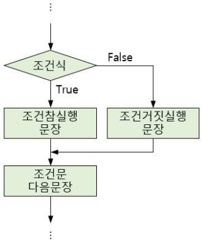

# Python - 조건문

<br/>

> 참고 자료 : <a href="https://www.codetree.ai/missions/4">Code Tree - Novice Low</a>

<br/>

## 조건문 개념

* 특정 조건을 만족할 경우에만 코드를 수행하고 싶을 때 쓰는, 매우 중요한 문법이다.

<br/>

## if 조건문

* <code>if</code> 조건식을 만족할 경우, <code>if</code>문의 내부 코드를 실행한다.

```python
if 조건식:
    조건식이 참일 경우 수행되는 코드 영역
```

<br/>

* python에서 <code>if</code>문의 가장 중요한 점은 들여쓰기다.  

    indent를 정확히 맞춰주어야 한다.

```python
a = int(input())
b = int(input())

if a >= 1 and b >= 1:
    a += 3
    b += 5

print(f"a = {a}, b = {b}")
```

▼ 입력 및 출력 결과

```
>> 1
>> 2

a = 4, b = 6
```

<br/>

* <code>==</code>기호는 값과 데이터 type이 모두 동일하야 True이다.

    * <code>1 == '1'</code>은 False이다.

* 정수 a가 짝수인지 홀수인지 판별하려면, <code>%</code>를 연산을 통해 a를 2로 나눈 나머지 값이 0인지 아닌지 판별하면 된다.

    ```python
    a = int(input())

    if a % 2 == 0:
        print("even number")
    ```
<br/>

## 조건식

* 조건식은 그 결과값이 <code>True</code>나 <code>False</code>로 나온다면 어떤 식이든 가능하다.

* 논리 연산자, 비교 연산자를 조건식에 사용하도 된다는 뜻이다.

<br/>

## if else 조건문

* <code>else</code>구문은 <code>if</code>문과 함께 조건문에 사용한다.

* <code>if</code> 조건식을 만족하지 않을 경우, <code>else</code>문의 내부 코드를 실행한다.


```
if 조건식:
    조건식이 참일 경우 수행되는 코드 영역
else:
    조건식이 거짓일 경우 수행되는 코드 영역
```

&nbsp;&nbsp;&nbsp;&nbsp;&nbsp;&nbsp;&nbsp;&nbsp; 

<br/>

```python
a = int(input())
b = int(input())

if a >= 1 and b >= 1:
    a += 3
else:
    b += 5

print(f"a = {a}, b = {b}")
```

▼ 입력 및 출력 결과

```
>> 1
>> 2

a = 4, b = 1
```
```
>> 1
>> 0

a = 1, b = 5
```

<br/>

## 삼항 연산자

* 삼항 연산자를 사용하면 조건문을 한 줄로 나타낼 수 있다.

``` python
if 조건:
    a = v1
else:
    a = v2
```
```python
a = v1 if 조건 else v2
```

<br/>

## if elif else 조건문

* <code>elif</code>구문은 <code>if</code>문, <code>else</code>문과 함께 조건문에 사용한다.

* <code>if</code> 조건식을 만족하지 않으나, <code>else</code> 조건식을 만족하는 경우, <code>elif</code>문의 내부 코드를 실행한다.

* <code>elif</code>은 여러 번 사용할 수 있으며, <code>elif</code>문을 통해 조건의 분기를 늘릴 수 있다.

```python
if 조건식1:
    코드 1
elif 조건식2:
    코드 2
else:
    코드 3
```

<br/>

```python
a = int(input())
b = 0

if a <= 0:
    pass
elif a <= 5:
    b = 1
elif a <= 10:
    b = 2
else:
    b = 3

print(b)
```

▼ 입력 및 출력 결과

```
>> 3

1
```
```
>> 10

2
```
```
>> 25

3
```

* <code>pass</code> keyword는 아무런 변화가 없음을 의미한다.

<br/>

## 조건문 여러 번 사용하기

<br/>

## 비교 연산자와 조건문

<br/>

> 사진 출처 : https://tioh.weebly.com/