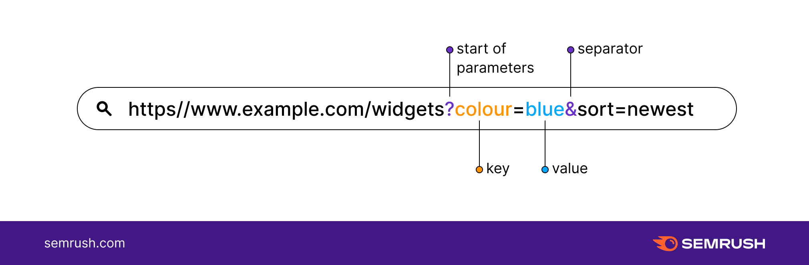

# React JS - Dynamic Routing & Query String

> 참고 자료 : <a href="https://nomadcoders.co/react-for-beginners">노마드 코더 - React JS로 영화 웹서비스 만들기</a>, 부트캠프 학습 자료

<br/>

### 목차

- <a href="https://github.com/SangYoonLee1231/TIL/blob/main/React%20JS/react_advanced_router.md#dynamic-routing-%EB%8F%99%EC%A0%81-%EB%9D%BC%EC%9A%B0%ED%8C%85">Dynamic Routing (동적 라우팅)</a>

- <a href="https://github.com/SangYoonLee1231/TIL/blob/main/React%20JS/react_advanced_router.md#useparams-hook"><code>useParams</code> Hook</a>
- <a href="https://github.com/SangYoonLee1231/TIL/blob/main/React%20JS/react_advanced_router.md#query-string-%EC%BF%BC%EB%A6%AC-%EC%8A%A4%ED%8A%B8%EB%A7%81">Query String (쿼리 스트링)</a>
- <a href="https://github.com/SangYoonLee1231/TIL/blob/main/React%20JS/react_advanced_router.md#react-router-dom%EC%97%90%EC%84%9C-%EC%BF%BC%EB%A6%AC-%EC%8A%A4%ED%8A%B8%EB%A7%81%EC%9D%98-%EC%82%AC%EC%9A%A9"><code>react-router-dom</code>에서 쿼리 스트링의 사용</a>
  - <a href="https://github.com/SangYoonLee1231/TIL/blob/main/React%20JS/react_advanced_router.md#uselocation-hook"><code>useLocation</code> Hook</a>
  - <a href="https://github.com/SangYoonLee1231/TIL/blob/main/React%20JS/react_advanced_router.md#usesearchparams-hook"><code>useSearchParams</code> Hook</a>

<br/><br/>

## Dynamic Routing (동적 라우팅)

### 정적 Routing

- Routing을 설정하는 가장 기본적인 방식은 <strong>정적 Routing</strong>이다.

  - 정적 라우팅은 Router 컴포넌트에서 미리 프로젝트에 사용할 경로들과 보여줄 컴포넌트들을 모두 정의해두는 방식이다.

    ```js
    import React from 'react';
    import { BrowserRouter, Route, Routes } from 'react-router-dom';

    const Router = () => {
      return (
        <BrowserRouter>
          <Routes>
            <Route path="/" element={<Main />} />
            <Route path="/post/1" element={<PageOne />} />
            <Route path="/post/2" element={<PageTwo />} />
            <Route path="/post/3" element={<PageThree />} />
          </Routes>
        </BrowsweRouter>
      )
    }

    export default Router;
    ```

  - 하지만 복잡하고 규모가 큰 애플리케이션에서는 경로를 미리 설정하는 Routing 방식만으론 처리하기 힘든 작업이 존재할 수 있다.

    (Route를 유연하게 정의할 수 없으므로)

<br/><br/>

### 동적 라우팅 (Dynamic Routing) 이란?

- 동적 Routing은 경로를 미리 정해두지 않고 동적으로 설정하는 방식이다.

<br/>

- 동적 Routing은 기존 (정적 Routing) 방식처럼 Route 설정 시 URL 전체의 형태를 미리 정의하지 않는다.

- 대신 특정 규칙을 만들고, 그 규칙과 부합하는 URL이 있을 경우에만 해당 element를 화면에 보여주는 방식으로 정적 Routing의 문제를 해결한다.

  - 특정 규칙의 예시 : <strong><code>/post/</code>로 시작하는 모든 URL은 상세페이지로 연결된다.</strong>

<br/>

- 동적 Routing을 사용하면 <code>/post/1</code> ,<code>/post/1000</code>, <code>/post/100000</code> 등 규칙을 만족하는 모든 URL을 상세페이지로 연결시킬 수 있기 때문에 더 확장성 있는 애플리케이션을 개발할 수 있다.

- 따라서 포스트가 추가되거나 삭제되는 등 변동이 생긴다 하더라도 Router 컴포넌트를 직접 수정할 필요가 없다.

<br/>

- <code>react-router-dom</code>에서 동적 라우팅을 구현하는 방법은 Route 컴포넌트의 path prop에 <code>:</code> 기호를 활용하는 것이다.

- <code>경로/:문자열</code>형태로 path를 설정하면 URL에서 <code>경로/</code> 뒤에 무슨 글자가 오든 이 Route로 연결된다.

  ```js
  import React from "react";
  import { BrowserRouter, Route, Routes } from "react-router-dom";

  export default function Router() {
    return (
      <BrowserRouter>
        <Routes>
          <Route path="/" element={<ListComponent />} />
          <Route path="/post/:id" element={<DetailPageComponent />} />
        </Routes>
      </BrowserRouter>
    );
  }
  ```

- 여기서 <code>:</code> 기호 뒤에 붙는 문자열(<code>id</code>)이 path parameter이다.

- path parameter는 URL에 있는 값을 마치 매개변수(parameter)처럼 사용하는 것이다.

- path parameter를 이용하면 사용자가 같은 페이지로 접속하더라도, 큰 틀은 동일하되 다른 UI를 보여주도록 처리할 수 있다.

<br/><br/><br/>

## <code>useParams</code> Hook

- <code>useParams</code>는 <code>react-router-dom</code>에서 제공하는 React Hook으로, path params의 값을 객체 형태로 반환해준다.

  - <strong>key</strong> : Route에서 설정한 path paramenter의 이름

  - <strong>value</strong> : Route에서 설정한 path paramenter에 실제로 전달된 값

    - <code>/post/:id</code>로 path를 설정했을 때, 유저가 <code>/post/1</code>로 접속할 경우 <code>useParams</code>가 반환하는 객체의 <strong>key</strong>는 <code>id</code>이고, <strong>value</strong>는 <code>1</code>이다.

    <br/>

  ```js
  // src/Router.js
  import { BrowserRouter, Routes, Route } from "react-router-dom";
  import List from "./pages/List";
  import Detail from "./pages/Detail";

  const App = () => {
    return (
      <BrowserRouter>
        <Routes>
          <Route path="/" element={<List />} />
          <Route path="/detail/:id" element={<Detail />} />
        </Routes>
      </BrowserRouter>
    );
  };

  export default App;
  ```

  ```js
  // src/Detail.js
  import React, { useState, useEffect } from "react";
  import { useParams } from "react-router-dom";

  const Detail = () => {
    const { id } = useParams();

    const [user, setUser] = useState({});

    useEffect(() => {
      fetch(`https://reqres.in/api/users/${id}`)
        .then((response) => response.json())
        .then((result) => setUser(result.data));
    }, [id]); // 4

    const { first_name, email, avatar } = user;

    return (
      <section>
        <article>
          <p>
            <strong>{first_name}</strong>
          </p>
          <p>{email}</p>
          
        </article>
      </section>
    );
  };

  export default Detail;
  ```

<br/><br/><br/>

## Query String (쿼리 스트링)

- 쿼리 스트링이란 URL의 한 부분으로서, URL에 '오름차순 정렬'과 같은 구체적인 정보를 포함하고자 할 때 사용한다.

- 규모가 크고 복잡한 애플리케이션에서 단순한 형태의 요청은 비효율을 발생할 수 있기 때문에 (예를 들어 모든 데이터를 매번 다 가져와야 하는 경우) 쿼리 스트링을 사용한다.

<br/><br/>

### Query String의 형태




- 쿼리 스트링은 <code>key=value</code> 형태의 문자열로 표현한다.

- URL에서 쿼리 스트링의 시작점은 <code>?</code> 문자를 통해 표시된다.

- 쿼리 스트링 내에서 각각의 <code>key=value</code> 페어를 구분할 때 <code>&</code> 문자를 사용한다.

<br/><br/><br/>

## <code>react-router-dom</code>에서 쿼리 스트링의 사용

- URL에 쿼리 스트링을 포함시켜주면 된다. 특별한 설정을 할 필요는 없다.

  - Link 컴포넌트 예시 : <code>\<Link to="/list?sort=popular" /></code>

  - navigate 함수 예시 : <code>navigate("/list?sort=popular")</code>

<br/><br/>

### 컴포넌트에서 쿼리 스트링 값 가져오기

- 쿼리 스트링을 포함해서 Routing을 해줬다면 이제는 컴포넌트에서 쿼리 스트링의 값을 가져올 수 있어야 한다.

- <code>react-router-dom</code>에서는 쿼리 스트링의 값을 편하게 가져올 수 있는 hook들을 제공한다.

- 이 hook들을 이용하면 쿼리 스트링의 값을 편하게 가져올 수 있으며, state처럼 쿼리 스트링의 값이 바뀌면 컴포넌트를 리렌더링 해주는 기능을 제공한다.

  - <code>useLocation</code> Hook, <code>useSearchParams</code> Hook

<br/><br/>

### <code>useLocation</code> Hook

- <strong><code>useLocation</code> Hook</strong>은 <strong>현재 Location 객체</strong>를 리턴한다.

- Location 객체는 현재 위치(URL)에 포함된 여러 가지 정보를 가지고 있다.

  - 객체 프로퍼티 : <code>pathname</code>, <code>search</code>, <code>hash</code>, <code>state</code>, <code>key</code>

  - 이 중 쿼리 스트링을 나타내는 프로퍼티는 <strong><code>search</code></strong>이다.  
    (문자열 형태로 제공된다. 예 : <code>"?sort=popular&sort=latest"</code>)

  ```js
  // src/List.js

  import React from "react";
  import { useLocation } from "react-router-dom";

  const List = () => {
    const { pathname, search, hash, state, key } = useLocation();

    return (
      <section>
        <h1>This is List Page</h1>
        <p>
          쿼리 스트링: <b>{search}</b>
        </p>
      </section>
    );
  };

  export default List;
  ```

<br/><br/>

### <code>useSearchParams</code> Hook

- <code>useSearchParams</code> Hook은 <code>useLocation</code> Hook을 통해 가져온 쿼리 스트링 (예 : <code>?sort=popular&sort=latest</code>) 에서 원하는 값만 꺼내올 수 있도록 도와주는 도구이다.

- <code>useSearchParams</code> Hook은 URLSearchParams 객체를 반환한다. 이 객체는 쿼리 스트링을 다루기 위한 여러 편리한 메서드를 제공한다.

  ```js
  const [searchParams, setSearchParams] = useSearchParams();
  ```

<br/>

#### 값을 읽어오는 메소드

- <code>searchParams.get(key)</code> : 쿼리 스트링에서 특정 key의 value 값 반환 (하나만)

- <code>searchParams.getAll(key)</code> : 쿼리 스트링에서 특정 key의 모든 value 값을 배열로 반환

- <code>searchParams.toString()</code> : 객체 형태의 쿼리 스트링을 문자열 형태로 반환

<br/>

#### 값을 변경하는 메소드

- <code>searchParams.set(key, value)</code> : 인지로 전달한 key값을 인자로 전달한 value로 덮어씌우는 메소드

  - <code>"?sort=popular&sort=latest"</code> 의 경우  
    <code>searchParams.set("sort", "clear")</code> 호출 시  
    <code>searchParams.toString()</code>의 리턴값 : <code>"?sort=clear"</code>

<br/>

- <code>searchParams.append(key, value)</code> : 인지로 전달한 key값을 인자로 전달한 value로 추가하는 매소드 (기존 값은 수정하지 않음)

  - <code>"?sort=popular&sort=latest"</code> 의 경우  
    <code>searchParams.set("sort", "clear")</code> 호출 시  
    <code>searchParams.toString()</code>의 리턴값 : <code>"?sort=clear"</code>

<br/>

- searchParams를 변경하는 메서드를 이용해서 searchParams의 값을 변경하더라도 실제 URL의 쿼리 스트링은 변경되지 않는다.

- 변경된 searchParams를 이용해서 실제 쿼리 스트링을 변경시키려면 setSearchParams 함수에 searchParams를 인자로 전달하면서 호출해야 한다.

  ```js
  // src/List.js
  // URL: /list?sort=popular&sort=latest

  import React from "react";
  import { useSearchParams } from "react-router-dom";

  const List = () => {
    const [searchParams, setSearchParams] = useSearchParams();

    const setSortParams = () => {
      searchParams.set("sort", "clear");
      setSearchParams(searchParams);
    };

    const appendSortParams = () => {
      searchParams.append("sort", "hello-world");
      setSearchParams(searchParams);
    };

    return (
      <section>
        <h1>This is List Page</h1>
        <p>
          toString: <b>{searchParams.toString()}</b>
        </p>
        <p>
          get("sort"): <b>{searchParams.get("sort")}</b>
        </p>
        <p>
          getAll("sort"):
          {searchParams.getAll("sort").map((value) => (
            <b key={value}>{value} </b>
          ))}
        </p>
        <button onClick={setSortParams}>setSortParams</button>
        <button onClick={appendSortParams}>appendSortParams</button>
      </section>
    );
  };

  export default List;
  ```
