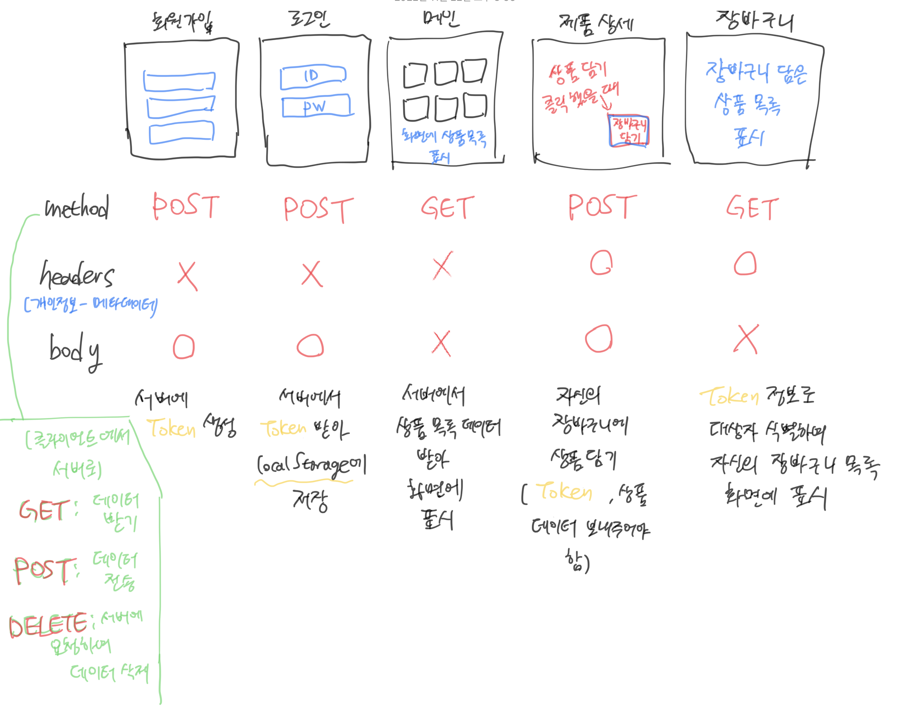

# React JS - 상수 데이터 & Mock Data

> 참고 자료 : 부트캠프 학습 자료

<br/>

### 목차

- <a href="https://github.com/SangYoonLee1231/TIL/blob/main/React%20JS/react_mock_data.md#%EC%83%81%EC%88%98-%EB%8D%B0%EC%9D%B4%ED%84%B0%EB%9E%80">상수 데이터란?</a>

- <a href="https://github.com/SangYoonLee1231/TIL/blob/main/React%20JS/react_mock_data.md#%EC%83%81%EC%88%98-%EB%8D%B0%EC%9D%B4%ED%84%B0-%ED%99%9C%EC%9A%A9%ED%95%98%EA%B8%B0">상수 데이터 활용하기</a>
- <a href="https://github.com/SangYoonLee1231/TIL/blob/main/React%20JS/react_mock_data.md#mock-data%EB%9E%80">Mock Data란?</a>
- <a href="https://github.com/SangYoonLee1231/TIL/blob/main/React%20JS/react_mock_data.md#fetch-%EB%A7%A4%EC%84%9C%EB%93%9C"><code>fetch</code> 매서드</a>
- <a href=""><code>fetch</code> 매서드 심화</a>

<br/><br/>

## 상수 데이터란?

- 변하지 않는 데이터

- React에서 데이터는 UI이다.

<br/>

- 시간이 흐름에 따라 변하는 변수 데이터로 UI를 만들 땐 백엔드 서버에서 데이터를 받아와야 한다.

- 반면 변하지 않는 상수 데이터로 UI를 만들 땐 백엔드 서버에서 데이터를 받아올 필요가 없다.

<br/><br/>

## 상수 데이터 활용하기

```js
/* App.js */
import React from "react";

const MENU_LIST = [
  { id: 1, menuName: "New Repository" },
  { id: 2, menuName: "Import Repository" },
  { id: 3, menuName: "New Gist" },
  { id: 4, menuName: "New Organization" },
  { id: 5, menuName: "New Project" },
];

const App = () => {
  return (
    <div>
      <ul>
        {MENU_LIST.map((menuList) => {
          return <li key={menuList.id}>{menuList.menuName}</li>;
        })}
      </ul>
    </div>
  );
};
```

- 반복되는 UI 구조는 상수 데이터와 map 매서드를 활용해 간결히 나타낼 수 있다.

- 이렇게 할 경우, 상수 데이터를 추가하거나 삭제하려면 JSX를 건드릴 필요 없이 상수 데이터 값만 바꾸면 된다.

<br/>

```js
/* App.js */
import React from "react";
import { MENU_LIST } from "./uiData";

const App = () => {
  return (
    <div>
      <ul>
        {MENU_LIST.map((menuList) => {
          return <li key={menuList.id}>{menuList.menuName}</li>;
        })}
      </ul>
    </div>
  );
};
```

```js
/* uiData.js */
export const MENU_LIST = [
  { id: 1, menuName: "New Repository" },
  { id: 2, menuName: "Import Repository" },
  { id: 3, menuName: "New Gist" },
  { id: 4, menuName: "New Organization" },
  { id: 5, menuName: "New Project" },
];
```

- 상수 데이터가 만일 너무 길어 가독성을 해치는 경우 위처럼 별도의 파일로 분리해서 관리할 수도 있다.

<br/><br/>

## Mock Data란?

- 프론트엔드 개발자가 필요에 의해 백엔드 API처럼 만든 UI (흉내낸) 데이터이다.

- 그렇기 때문에, Mock Data를 만들 땐 백엔드 API의 구조를 우선적으로 확인해야 한다.

  (API의 key-value를 확인한다. 그 후 <code>json</code> 확장자 명으로 Mock Data를 만든다.)

<br/>

- 생성한 Mock Data는 <code>public</code> 폴더 하위의 <code>data</code> 폴더에서 관리한다.

  - Mock Data는 서버에서 받아올 데이터의 모조 데이터이므로로컬 서버에서 받아오도록 구현해야 한다.

  - 그렇기 때문에 npm start 시 로컬 서버에 올려지는 폴더인 <code>public</code> 폴더의 하위에서 관리해야 한다.

<br/>

### Mock Data의 구조

- Mock Data 에시

  ```json
  // public/data/recommendData.json

  [
    {
      "id": 1,
      "name": "[돈마루] 한돈 삼겹살 2종 (냉장)",
      "discount_rate": 5,
      "discounted_price": 12967,
      "original_price": 13650,
      "is_sold_out": false
    },
    {
      "id": 2,
      "name": "엔다이브 2~3입",
      ...
    },
  ...
  ]
  ```

<br/>

### Mock Data를 쓰는 이유

- 백엔드 API가 미완성인 상태에서도 차질없이 개발을 진행하기 위해서이다.

- Mock Data를 쓰면 실제 API가 없더라도 API 데이터처럼 UI 랜더링이 가능해진다.

- API가 완성된 이후에 Mock Data에서 실제 API로 원활한 수정이 가능하다.

<br/><br/>

## <code>fetch</code> 매서드

- Mock Data를 만들고 난 후 이를 <strong>호출</strong>할 때 쓰이는 매서드이다.

  (실제 API를 호출할 때도 <code>fetch</code> 매서드를 쓴다.)

  ```js
  fetch("/data/파일명.json");
  ```

  - 파일의 경로는 <code>public</code> 폴더를 기준으로 적는다.

  - <code>public</code> 폴더 하위 <code>data</code> 폴더에 Mock Data 파일이 있기 때문에 위와 같이 경로를 적어준다.

<br/>

### Step 1. Mock Data 받아 state에 저장하기

- <code>fetch</code> 호출 이후에 <code>then()</code> 매서드를 두 번 호출한다.

  ```js
  fetch("/data/파일명.json")
    .then(response -> response.json())
    .then(result => setState(result));
  ```

  - 첫 번째 <code>.then</code> 매서드에 인자로 callBack을 전달하고 <strong>JSON 형태</strong>의 데이터가 들어온다. 이 데이터를 <strong>자바스크립트 형태로 변환</strong>하고 반환한다.

  - 두 번째 <code>.then</code>에서는 인자로 callBack을 전달하고, 매개변수에서는 첫 번째 <code>.then</code>에서 반환된 객체를 result로 받아 <code>setState</code> 함수로 <strong>result를 state에 저장</strong>한다.

- 이렇게 하면 state에 Mock Data를 저장하고, 언제든 꺼내 쓸 수 있게 되었다.

- 하지만 아직 이를 호출하는 작업은 하지 않았는데, 이는 상황에 맞춰 진행하면 된다.

<br/>

### Step 2. 받아온 Mock Data 호출하기

- <strong>데이터를 호출하는 시점은 상황에 따라 각기 다르다.</strong>

  - 버튼을 클릭했을 때 UI가 그려져야 하는 경우도 있고, 페이지를 불러올 때 바로 화면에 UI를 그려줘야 하는 경우도 있다.

  - 이 때 전자는 <code>이벤트 함수</code> 내에서, 후자는 <code>useEffect</code> 안에서 fetch 매서드를 호출하면 된다.

<br/><br/>

## <code>fetch</code> 매서드 심화

- <code>fetch</code> 매서드의 두 번째 인자로 options 객체를 줄 수 있다.

  ```js
  fetch(url, options)
    .then(response => response.json())
    .then(result => /* 결과 처리 */)
  ```

  ```js
  fetch("/data/sliderData.json", {
    method: "GET",
  })
    .then((response) => response.json())
    .then((data) => {
      setSliderData(data);
    });
  ```

<br/>

- options 객체에는 HTTP 방식(method), HTTP 요청 헤더(headers), HTTP 요청 전문(body) 등을 설정해줄 수 있다.

  - <strong>method (HTTP 방식)</strong>

    - GET 호출 : 서버(원격 API)에서 데이터 수신

    - POST 호출 : 서버(원격 API)로 데이터 전송, 원격 API에서 관리하고 있는 데이터 생성

    - PUT, DELETE 호출 : 서버에 요청, 원격 API에서 관리하는 데이터의 수정 또는 삭제

  - <strong>headers (HTTP 요청 헤더)</strong>

    - fetch에 요청 헤더를 설정

    - 사용자 Access Token과 같은 메타 데이터를 담아 전송

  - <strong>body (HTTP 요청 전문)</strong>

    - JSON 문자열이나 FormData 객체와 같은 데이터를 본문에 담아 전송

<br/>

- 응답(response) 객체로 부터는 HTTP 응답 상태(status), HTTP 응답 헤더(headers), HTTP 응답 전문(body) 등을 읽어올 수 있다.

<br/>


