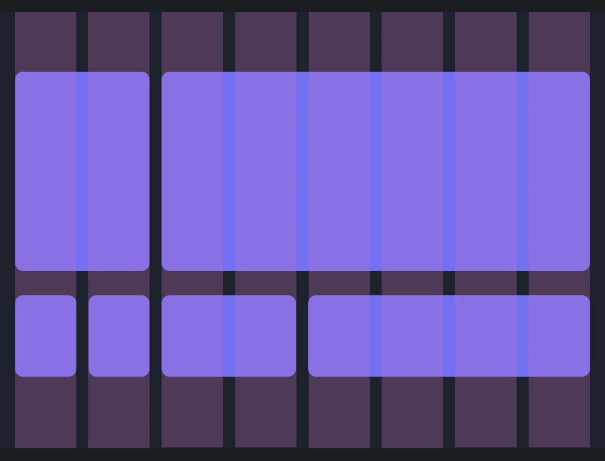
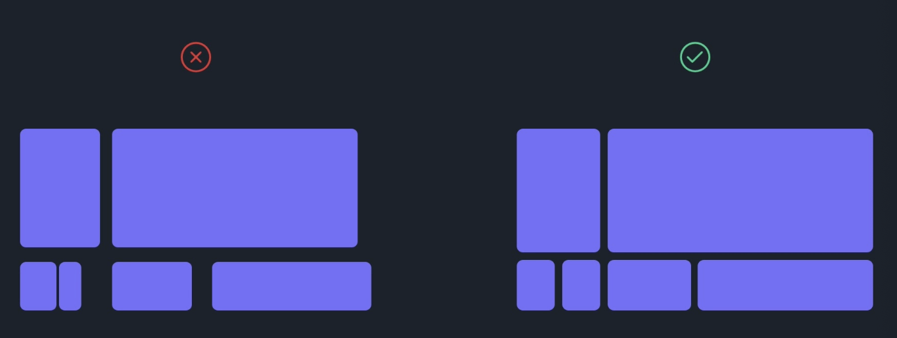
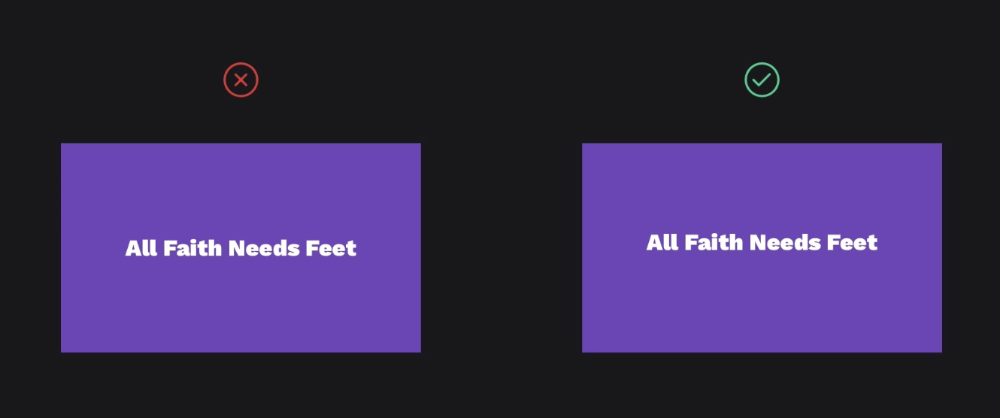

# 웹 디자인의 기초

> 참고 자료 : <a href="https://www.udemy.com/course/web-design-figma-webflow-freelancing">Udemy 강의 - 【한글자막】 웹 디자인 마스터 과정: Figma부터 Webflow, 프리랜서 활동까지</a>

 

### 목차

- <a href="https://github.com/SangYoonLee1231/TIL/blob/main/Web_Design/web_design_basic.md#%EB%94%94%EC%9E%90%EC%9D%B8%EC%97%90-%EB%8C%80%ED%95%9C-%EC%98%A4%ED%95%B4">디자인에 대한 오해</a>
- <a href="https://github.com/SangYoonLee1231/TIL/blob/main/Web_Design/web_design_basic.md#%EB%94%94%EC%9E%90%EC%9D%B8%EC%9D%98-%EA%B8%B0%EC%B4%88---%EB%A0%88%EC%9D%B4%EC%95%84%EC%9B%83">디자인의 기초 - 레이아웃</a>

  - <a href="https://github.com/SangYoonLee1231/TIL/blob/main/Web_Design/web_design_basic.md#%EC%A0%95%EB%A0%AC-align">정렬 (Align)</a>
  - <a href="https://github.com/SangYoonLee1231/TIL/blob/main/Web_Design/web_design_basic.md#%EA%B7%B8%EB%A6%AC%EB%93%9C-grid">그리드 (Grid)</a>
  - <a href="https://github.com/SangYoonLee1231/TIL/blob/main/Web_Design/web_design_basic.md#%EC%8B%9C%EA%B0%81%EC%A0%81-%EA%B3%84%EC%B8%B5%EA%B5%AC%EC%A1%B0-visual-hierarchy">시각적 계층구조 (Visual Hierarchy)</a>
  - <a href="">착시현상 주의 (Optical Illusions)</a>
  - 

  

### 디자인에 대한 오해

- <strong>디자인은 정신적인 기술이며 사물을 보는 방식이다.</strong>

- 물론 창의성도 중요하지만, 디자이너가 되기 위해 진정으로 필요한 능력은 창의성이 아니라고 한다.

- 즉, 타고난 재능이 없어도 누구나 웹 디자이너가 될 수 있다.

- 디자인에는 <strong>규칙, 기술, 지침</strong>이 있고 이를 잘 학습하여 따르면 누구나 디자인을 잘 할 수 있다.

   

## 디자인의 기초 - 레이아웃

### 정렬 (Align)

- 물체를 정렬하면 구성이 더 좋아지고 질서정연해진다.

- <strong>정렬</strong>은 단순하고 기본적이지만, 가장 강력한 디자인 규칙에 속한다.

- 개체를 정렬하는 방법은 6가지가 있다.

  - <strong>왼쪽 정렬</strong> : 객체를 정렬하는 가장 자연스러운 방법이다. (보통 글을 읽을 때 왼쪽 위 모서리부터 보기 시작하므로)

  - <strong>중앙 정렬</strong> : 인쇄보단 웹 디자인에서 자주 볼 수 있다.

  - <strong>오른쪽 정렬</strong> : 아랍어, 히브리어처럼 오른쪽에서 왼쪽으로 읽는 언어권에서 자연스러운 정렬이다.

  - 수평축에 물체 정렬 방법 - <strong>상단 정렬</strong>, <strong>수평축 정렬</strong>, <strong>하단 정렬</strong>

   

   

   

  

### 그리드 (Grid)

- 정렬을 하면 레이아웃이 일종의 구조를 형성하기 시작하는데, 이를 <strong>그리드</strong>라 한다.

- 요소를 페이지에 인식 가능한 구조로 배치해서 정리하는 방법이다.

- 그 중에서도 정말 좋은 디자인은 <strong>같은 크기로 나누어진 그리드</strong>이다.

  

  

  ↓

  

  

 

- 일반적으로 웹 디자인에서 가장 널리 사용되는 레이아웃 그리드는 <strong>12열 그리드</strong>이다.

  - 12는 3과 4의 배수이므로 열을 나눌 수 있는 선택지가 많기 때문이다.

   

  

  

  

 

- 같은 크기로 나눈 열에 맞춰 요소를 정렬한 후 그 다음 작업은, <strong>같은 값을 최대한 많이 재사용하는 것</strong>이다.

  - 예 : 요소 간 간격을 같은 값으로 맞춰 일정히 유지하기

   

  

  

  

 

- 그리드의 규칙은 <strong>유연</strong>하다.

- 사용에 따라 그리드의 규칙의 제약에서 벗어날 때도 있다.

  - 다만, 디자인의 규칙을 어길 때는 그 목적이 분명해야 한다.

- 그래도 처음엔 그리드를 적용해서 디자인을 하는 것이 좋은 디자인 습관을 익히는 최상의 방법이다.

 

#### 그리드가 중요한 이유

- 그리드는 명료한 느낌을 준다.

- 사용자는 눈에 보이지 않는 격자선을 실제로 체감한다.

- 반복되는 그리드로 인해 무언가가 예측 가능하고 친숙해 보이는 느낌이 들 때 사용자는 웹 사이트를 더욱 신뢰한다.

  

### 시각적 계층구조 (Visual Hierarchy)

- <strong>시각적으로 가장 중요한 정보부터 순서대로 눈에 들어오도록</strong> 웹 페이지의 요소들을 배치하는 디자인의 중요한 기본 원칙이다.

- 사람은 어떤 대상을 볼 때 **초점**이 맞는 대상은 또럿히 보나 그 주변은 흐릿하게 본다. 즉, 사람의 시선은 한 번에 하나의 대상에만 집중할 수 있다.

- 좋은 디자인을 볼 때, 보통 <strong>시각적 계층구조가 그 디자인의 아름다움에 이바지한다.</strong>

- 따라서 객체들 사이에 명확한 계층구조를 만드는 것은 매우 중요한 디자인 작업이다.

 

#### 시각적 계층구조를 생성하는 방법

- 일반적으로 요소의 <strong>크기</strong>와 <strong>비중</strong>이 계층을 규정한다.

- 색상 대비나 많은 관심을 끄는 이미지 등 계층을 규정하는 수단엔 여러 가지가 존재하지만,  
  디자이너들은 주로 크기와 비중에 의존한다.

 

### (예시)

 

- <strong>(1~2) 사진 + 이름</strong>

  - 우선 사진의 크기를 늘려 시각적으로 가장 먼저 눈에 들어오도록 하였다. 화면에서 가장 큰 객체가 가장 큰 관심을 끌 것이기 때문이다.

  - 사진 뒤의 보라색 배경도 사진에 대한 관심을 좀 더 끌어내고 있다.

  - 이름은 가장 큰 관심을 차지하는 사진의 내부에 존재하므로, 사진 다음으로 시선이 머물게 된다.

 

- <strong>(3~5) 제목, 단락, 버튼</strong>

  - 그 다음 제목, 단락, 버튼 사이의 계층을 규정했다.

  - 제목은 글씨를 크고 굵게 설정하여 대담하게 만들어졌다. 이 대담성이 바로 요소의 '비중'이다.

  - 제목 하단에 있는 단락은 제목보다 크기가 상당히 작게 설정되었다.

  - 그리고 버튼은 테두리만으로 투명하게 만들어졌다.

    (이를 '고스트 버튼'이라 부름 - 유의성을 줄이고자 할 때 유용하다)

 

- <strong>그 이외의 디자인 요소</strong>

  - 그리드와 왼쪽 정렬을 통해 세련되고 정돈된 디자인을 표현하였다.

  

### 착시현상 주의 (Optical Illusions)

- 착시현상에 의해 두 물체의 크기가 실제로는 동일하지만 사용자의 눈에 다르게 보일 수 있다.

- 그럴 경우, 우리는 **사용자의 눈에 두 물체가 같은 크기로 보이도록 작아보이는 물체의 크기를 실제로 키워주어야 한다.**

  

  

  

  - 얼마나 확대해야 하는지에 대한 규칙은 없다. 눈대중으로, 같은 크기로 느껴질 때까지 계속 확대해주면 된다.

- 이를 두고 디자이너들은 보통 '**객체의 무게감**'이란 말을 쓴다. 즉, 무게감이 더 큰 객체가 (실제로는 같음에도) 더 넓거나 길어보이는 것이다.

- 이러한 작은 디테일이 아마추어와 전문가의 차이를 만든다.

 

- <strong>Tip) 글자를 정렬할 때 항상 중앙에 정확히 정렬하지 말고, 살짝 위로 올리자.</strong>

  

  

  

  - 텍스트가 가라앉는 느낌이 아닌, 떠다니는 느낌을 주어야 사용자들에게 좋은 인상을 줄 수 있다.

  - **상황에 따라 항상 이렇게 할 필요는 없다. 텍스트를 중앙 정렬을 했을 때 가라앉는 느낌이 든다면 고치자.**

 
